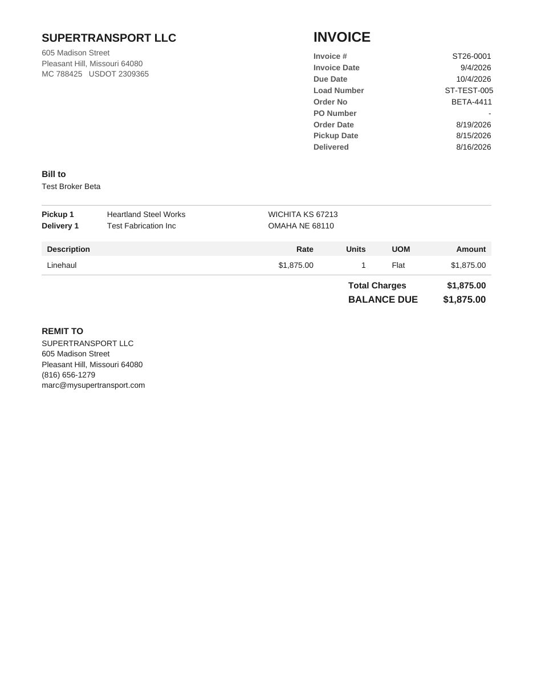

# Alvys M2 pass 2 — billing settings, factoring company record, invoice PDF

Prompt received complete, ending with: "END OF PROMPT — the first line of your report must say whether you received this prompt complete, ending with this line."

2026-09-25 12:43 UTC. BUILD MODE.

## Caveat first
The Alvys packet (invoice 1004962) and the two SFF payout statements were **not** in the uploaded files. The layout follows the field-by-field description in the prompt, not a visual comparison with the real packet. Please upload the packet so the PDF can be checked against it.

## Step 0 — P69–P72 recorded verbatim in docs/tms-build-status.md.

## Step 1 — Settings (0068)
- `billing_settings` (one per company), `factoring_companies` (one default per company). Both: company_id NOT NULL + `aa_stamp_tenant_company_id` + restrictive `tenant_isolation`; staff read; management/owner write; validation triggers (valid email, no duplicates, no address in both lists, 10 max, packet order checked).
- Seed by USDOT 2309365: SUPERTRANSPORT LLC, 605 Madison Street, Pleasant Hill, Missouri 64080, (816) 656-1279, marc@mysupertransport.com, 30 days; Smart Freight Funding default, 2.00, combined, default order (14 types), empty email lists.
- Screen: Management → Accounting → Billing Settings. Chips with Add/Remove; order with up/down arrows. Dispatchers see it read-only (no Add, Remove, Save).

## Step 2 — Fixes (0068)
(a) `post_invoice_payment_internal` writes `payments.source = 'factor'`; 0067 company checks kept. (b) `invoice_line_items_view_permission`: SELECT only, `(SELECT has_permission('invoice.view'))`.

## Step 3 — Invoice PDF
- Private bucket `invoice-files` (10 MiB), path `{company_id}/{invoice_id}.pdf`. Storage read policy: same company folder + invoice.view. No client write policy. 0069 wraps that policy's `has_permission` in a sub-SELECT (found by the permission-wrapper guard).
- `invoice_files`: invoice_id UNIQUE, storage_path, sha256, byte_size, page_count, generated_at, generated_by; tenancy habits; SELECT under invoice.view; no client writes.
- Edge function `generate-invoice-pdf` deployed: getClaims; dispatcher/management/owner; `companyIdForUser`; every read scoped by company; dry_run returns bytes only; saves once and never replaces; refuses when lines ≠ amount to the cent.
- Screens: after Create invoice succeeds the PDF is made automatically; Billing Queue lists recent invoices with **Invoice PDF** / **Create PDF**; the load page shows the invoice with the same button. No sending.

## Step 4 — Proof
Raising transaction (scratch carrier B, scratch load PROOF-PDF-1 on the factoring-approved Test Broker Alpha). Output verbatim:
```
1. B sees billing_settings=0 factoring_companies=0
   B UPDATE ST billing_settings rows=0
   B UPDATE ST factoring_companies rows=0
   B DELETE ST factoring_companies rows=0
   B INSERT naming ST lands on B: true
   Leo reads billing_settings=1 factoring_companies=1
   Leo UPDATE billing_settings rows=0
   Leo UPDATE factoring_companies rows=0
   Leo INSERT factoring_companies: 42501 new row violates row-level security policy for table "factoring_companies"
   Erika bad email: 22000 "not-an-email" is not a valid email address.
   Erika duplicate: 23505 Send-to already lists a@proof.invalid.
   Erika same in send-to and CC: 23505 An address cannot be both a send-to and a CC address.
   Erika eleventh address: 22000 CC can hold at most 10 addresses.
   Erika ten addresses rows=1
   Erika bad remit-to email: 22000 "nope@" is not a valid email address.
2. Erika create_invoice: ST26-0002 factored
   posted=1 unmatched=0
   payment: factor gross 1000.00 fee 20.00 net 980.00
   invoice status=paid load status=paid
3. Leo reads PROOF invoice lines=1
   Leo UPDATE lines rows=0
   Leo DELETE lines rows=0
   Leo INSERT invoice_files: 42501 new row violates row-level security policy for table "invoice_files"
   Leo upload to invoice-files: 42501 new row violates row-level security policy for table "objects"
   B reads invoice lines=0
ST26-0001 updated_at unchanged: true
```
Two setup corrections on the way, both proof-only: the PROOF invoice's `submitted_at` had to be two days back (see finding 1), and the broker had to be factoring-approved (finding 2).

### 4. Live PDF, dry_run on ST26-0001 (management session)
HTTP 200, `application/pdf`, `X-Invoice-Saved: false`, `X-Page-Count: 1`; `pdfinfo` Pages: 1. Total $1,875.00 = invoices.amount. Extracted text:
```
SUPERTRANSPORT LLC                                   INVOICE
605 Madison Street                                   Invoice #                 ST26-0001
Pleasant Hill, Missouri 64080
                                                     Invoice Date                 9/4/2026
MC 788425 USDOT 2309365
                                                     Due Date                   10/4/2026
                                                     Load Number              ST-TEST-005
                                                     Order No                  BETA-4411
                                                     PO Number                           -
                                                     Order Date                 8/19/2026
                                                     Pickup Date                8/15/2026
                                                     Delivered                  8/16/2026


Bill to
Test Broker Beta


Pickup 1           Heartland Steel Works   WICHITA KS 67213
Delivery 1         Test Fabrication Inc    OMAHA NE 68110


 Description                                     Rate         Units    UOM      Amount

 Linehaul                                    $1,875.00           1     Flat    $1,875.00

                                                              Total Charges   $1,875.00
                                                              BALANCE DUE     $1,875.00


REMIT TO
SUPERTRANSPORT LLC
605 Madison Street
Pleasant Hill, Missouri 64080
(816) 656-1279
marc@mysupertransport.com
```


Afterwards: invoice_files 0; invoice-files objects 0; ST26-0001 updated_at still `2026-09-17 21:37:10.352836+00`.

### 5. Refusals, live
No sign-in → 401 `{"error":"Unauthorized"}`. Demo driver → 403 `{"error":"Forbidden"}`. Random invoice id → 404 `{"error":"Invoice not found"}`.

### Residue (exact)
`proof_loads=0 invoices=1 payments=0 remittances=0 invoice_files=0 objects=0 seq=2`

## Found, not fixed (wish list)
1. A remittance dated the same day an invoice was submitted sets `paid_at` to midnight, before `submitted_at`; `invoices_lifecycle_order_check` refuses it. For the payout pass.
2. P68 says everything goes through SFF, but remittances need `billing_path = 'factored'`, which comes from broker status (1 approved, 1 not approved, 11 unknown). **Owner decision needed** before the payout pass.

## Tests
- New: `src/test/invoice-pdf-model.test.ts` (7), `src/test/billing-settings-invoice-pdf.test.ts` (6), `billingSettings.test.tsx` (3), `billingQueueInvoicePdf.test.tsx` (1). All pass.
- Full suite, `--maxWorkers=2`. Run as one it passed 590 s and was killed (EXIT 124), so it ran in three parts:
```
part 00:  Test Files  70 passed | 1 skipped (71)   Tests  529 passed | 1 skipped (530)
part 01:  Test Files  76 passed | 1 skipped (77)   Tests  805 passed | 1 skipped (806)
part 02:  Test Files  7 failed | 81 passed (88)    Tests  9 failed | 948 passed | 17 skipped (974)   Errors 2 errors
```
- Part 02 failures: **real, fixed** — billing-schema (2: line items now have two permissive policies), tenancy-resolver (2: three new stamped/tenant tables not in the lists), storage-bucket-limits (1: new bucket not recorded), permission-wrapper-guard (1: bare has_permission, fixed by 0069). **Pooler** `EAUTHQUERY auth_query secret check timed out` — apply-link-identity, broker-tracking-link, fuel-import-live. Two errors were vitest `Timeout calling "onTaskUpdate"`.
- Rerun of all 7 plus the new DB test:
```
 Test Files  8 passed (8)
      Tests  209 passed | 1 skipped (210)
     Errors  1 error   (vitest-worker: Timeout calling "onTaskUpdate")
```
- Typecheck (`tsgo --noEmit -p tsconfig.app.json`): exit 0.

## Files git shows changed in this window
docs/storage-bucket-limits.md, docs/passes/assets/2026-09-25-invoice-pdf-ST26-0001.png, drizzle/migrations/0068_billing_settings_invoice_pdf.sql, drizzle/migrations/0069_invoice_files_storage_policy_wrap.sql, drizzle/migrations/meta/0068_snapshot.json, drizzle/migrations/meta/0069_snapshot.json, drizzle/migrations/meta/_journal.json, src/integrations/supabase/types.ts, src/components/billing/InvoicePdfButton.tsx, src/components/billing/LoadInvoiceCard.tsx, src/lib/invoicePdf.ts, src/pages/dispatch/LoadDetailPage.tsx, src/pages/management/BillingQueuePage.tsx, src/pages/management/BillingSettingsPage.tsx, src/pages/management/ManagementPortal.tsx, src/pages/management/__tests__/billingQueueInvoicePdf.test.tsx, src/pages/management/__tests__/billingSettings.test.tsx, src/test/billing-schema.test.ts, src/test/billing-settings-invoice-pdf.test.ts, src/test/invoice-pdf-model.test.ts, src/test/storage-bucket-limits.test.ts, src/test/tenancy-resolver.test.ts, supabase/config.toml, supabase/functions/_shared/invoice/model.ts, supabase/functions/_shared/invoice/renderPdf.ts, supabase/functions/generate-invoice-pdf/index.ts, plus this report, roadmap.md, docs/tms-build-status.md, docs/tms-wish-list.md. (git's window also shows pass-1 files committed after 11:15 — the pass-1 report, loadDetailOperatorAccess.test.tsx, nav-target.test.ts — and the auto-written public/version.json; none were edited in this pass.)
