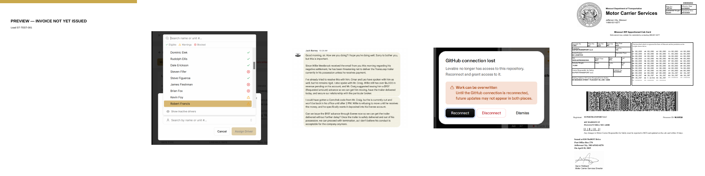
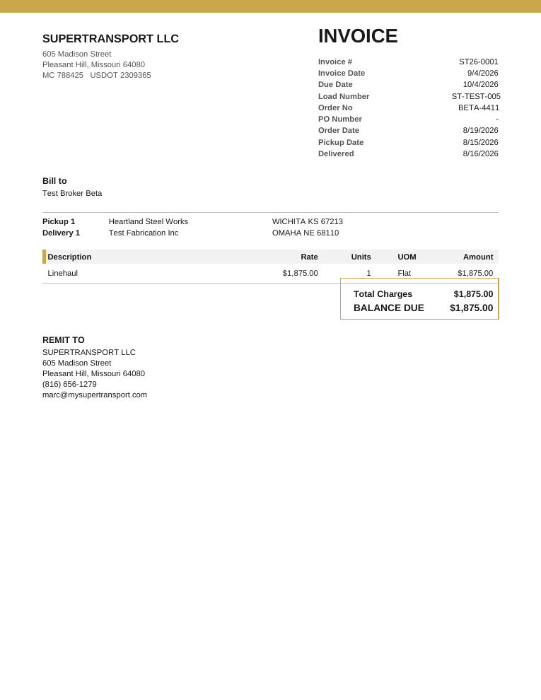

I received this prompt complete, ending with the line "END OF PROMPT — the first line of your report must say whether you received this prompt complete, ending with this line."

# Alvys M2 pass 4 — required documents become settings; pass 3's proof; green suite (2026-09-25 15:37 UTC)

## 0. Owner decisions recorded
P78 and P79 are in docs/tms-build-status.md word for word.

## 1. Required documents as settings (migration 0073)
- `document_requirements`: one row per company and document type. Columns: required_before_invoicing (always / when_applies / no), applies_when (only lumper_billed, per_ton, detention_billed, loadout), in_packet, position. `document_requirement_settings`: one row per company with bol_or_pod_either. Both tables follow the three tenancy habits: company_id NOT NULL, stamped by a trigger, restrictive tenant_isolation. Staff and the company's own drivers can read them; only management and owner can write them. `factoring_companies` is untouched for drivers.
- Packet order and includes were copied from Smart Freight Funding without changes. The old `factoring_companies.packet_order/packet_includes` columns are left in place and commented DEPRECATED, because dropping a column is a breaking change. Removing them is on the wish list.
- SUPERTRANSPORT seed (14 rows): rate confirmation Always (a revised rate confirmation also satisfies it); lumper receipt, scale ticket and both loadout inspections When it applies; BOL No, POD No, either-one switch on; everything else No.
- `invoice_readiness_missing` now reads these settings. It adds "Broker is marked not approved by the factor" when a default factor exists and the broker is not_approved. It refuses anyone who is not dispatcher, management or owner. **Disclosure:** the role check is inside the function. EXECUTE is still granted to `authenticated` (and service_role), as it was in 0072, because the Billing Queue calls it from the browser. Proof 4.1.14 shows the demo driver is refused.
- `create_invoice`: billing_path is 'factored' whenever a default factor exists, including for "unknown" brokers. Every other line is as it was in 0071.
- `loadPaperwork.ts` takes the settings as input. Callers get them through `src/lib/documentRequirements.ts`: the dispatch Documents section, the driver's upload screen, and driver home reminders. Rate confirmation and office-only types are checked only at invoicing. A BOL or POD that is not required still shows as 'expected'.
- Billing settings screen: the either-one switch, then one list with the Required choice, the packet switch and up/down arrows for each type. The separate pass-3 include switches were removed.
- The packet function now reads order and includes from `document_requirements`. Packet style still comes from the factor. It is redeployed.

## 2. The two unrequested pass-3 changes
(a) Resolved exceptions. `document_exceptions.resolving_document_id` is nullable, and no constraint ties a resolved exception to a document of the same type (there are 0 exception rows today). So a resolved exception does NOT always carry its document. The old behaviour is restored: a resolved exception satisfies the requirement and shows as `exception_resolved`. The database `_load_has_paperwork` already worked this way, and 0073's readiness does too (parity case 20).
(b) Startup crash fix (src/main.tsx, src/lib/lazyWithRetry.ts). What crashed: the preview's first dynamic import of the app module (App.tsx, plus the roadside entry) sometimes rejected on a stale or temporarily failed Vite chunk. That left a blank white page. How it was found: the preview went blank during pass 3's browser check. Only the preview was seen to fail; nobody reported it on the published site. The fix retries once, reloads once for stale chunks, and otherwise shows a retry screen. It changes no data, roles or portal behaviour, and nothing else. It is kept.

## 3. TS and database agree (30 cases)
The fixture is `src/test/fixtures/readiness-parity-cases.json`. The TS side is checked by `src/lib/__tests__/readinessParity.test.ts` (31 tests pass). The SQL side ran the same 30 cases through `invoice_readiness_missing` in a raising transaction: 30 of 30 identical.

| # | case | TS | SQL | |
|---|---|---|---|---|
| 1 | defaults: BOL + rate con | (ready) | (ready) | same |
| 2 | defaults: POD + rate con | (ready) | (ready) | same |
| 3 | defaults: neither BOL nor POD | Signed delivery paperwork — BOL or POD | same text | same |
| 4 | defaults: missing rate con | Rate confirmation | same text | same |
| 5 | revised rate con satisfies | (ready) | (ready) | same |
| 6 | either off, nothing signed, all No | (ready) | (ready) | same |
| 7 | either off, BOL Always, POD only | Bill of lading | same text | same |
| 8 | lumper billed, no receipt | Lumper receipt | same text | same |
| 9 | lumper billed, receipt present | (ready) | (ready) | same |
| 10 | lumper billed, lumper set No | (ready) | (ready) | same |
| 11 | no lumper billed, no receipt | (ready) | (ready) | same |
| 12 | per-ton, no scale ticket | Scale ticket | same text | same |
| 13 | per-ton, scale ticket present | (ready) | (ready) | same |
| 14 | standard load, no scale ticket | (ready) | (ready) | same |
| 15 | detention When, billed, no doc | Detention documentation | same text | same |
| 16 | detention When, not billed | (ready) | (ready) | same |
| 17 | detention default No, billed | (ready) | (ready) | same |
| 18 | approved POD exception | (ready) | (ready) | same |
| 19 | pending POD exception | Signed delivery paperwork — BOL or POD | same text | same |
| 20 | resolved POD exception | (ready) | (ready) | same |
| 21 | approved rate con exception | (ready) | (ready) | same |
| 22 | loadout, all photos | (ready) | (ready) | same |
| 23 | loadout, delivery signage missing | Delivery inspection — Delivery Location Signage | same text | same |
| 24 | loadout, slot waived by approved exception | (ready) | (ready) | same |
| 25 | loadout, loadout photos set No | (ready) | (ready) | same |
| 26 | broker with no address | Broker billing address | same text | same |
| 27 | broker not approved | Broker is marked not approved by the factor | same text | same |
| 28 | broker unknown | (ready) | (ready) | same |
| 29 | no broker | Broker billing address | same text | same |
| 30 | everything missing, per-ton lumper load | BOL or POD; Rate confirmation; Lumper receipt; Scale ticket; Broker billing address | same list | same |

## 4. Proof (raising transactions; edge functions dry-run; ST26-0001 read only)
4.1 Paperwork cases on PROOF loads:
```
4.1.1 BOL only: ADMITTED
4.1.2 POD only: ADMITTED
4.1.3 neither BOL nor POD: REFUSED "Missing before invoicing: Signed delivery paperwork — BOL or POD."
4.1.4 missing rate con: REFUSED "Missing before invoicing: Rate confirmation."
4.1.5 lumper, no receipt: REFUSED "Missing before invoicing: Lumper receipt."
4.1.6 lumper, receipt set to No: ADMITTED
4.1.7 per-ton, no scale ticket: REFUSED "Missing before invoicing: Scale ticket."
4.1.8 broker without address: REFUSED "Missing before invoicing: Broker billing address."
4.1.9 broker not approved: REFUSED "Missing before invoicing: Broker is marked not approved by the factor."
4.1.10 broker unknown: ADMITTED
4.1.11 approved POD exception: ADMITTED
4.1.12 switch off + BOL Always, POD only: REFUSED "Missing before invoicing: Bill of lading."
4.1.13 create_invoice after rate con removed from a ready load: REFUSED "Missing before invoicing: Rate confirmation."  invoices after refusal: 1
4.1.14 demo driver calls invoice_readiness_missing: REFUSED "Only a dispatcher, management or owner may check invoice readiness."
```
4.2 Settings:
```
scratch carrier B (management): reads 0 of 14 rows; row update changed 0; switch update changed 0; insert REFUSED (row-level security)
SUPERTRANSPORT driver Jamian Anderson: reads 14 of 14; row update changed 0; switch update changed 0; insert REFUSED (row-level security)
dispatcher Leo Wallace: reads 14 of 14; row update changed 0; switch update changed 0; insert REFUSED (row-level security)
```
Caveat: inside the proof, the scratch carrier B's own setup insert was also refused by row-level security, because the simulated identity did not resolve to carrier B. So "reads 0 / changes 0" shows that an outsider gets nothing. It does not show a fully set-up second carrier. Nothing was committed.

4.3 Packets (live, dry run):
- ST-TEST-001: HTTP 200, 5 pages, 483,898 bytes (473 KB).
  | page | type | source file |
  |---|---|---|
  | 1 | invoice | preview invoice |
  | 2 | pod | Screenshot 2026-08-19 182618.png |
  | 3 | pod | Screenshot 2026-08-13 155752.png |
  | 4 | rate_confirmation | Screenshot 2026-08-18 182605.png |
  | 5 | revised_rate_confirmation | 148 Registration.pdf |
  Thumbnails: 
- ST-TEST-003: HTTP 409 `{"error":"pod-TESTRUN.pdf could not be read: Cannot read properties of undefined (reading 'Pages')"}`. The stored file is not a readable PDF. The packet refuses it by name, as designed. There are no pages to attach. The file was not changed; this is an open finding.

4.4 ST26-0001 in the new look (dry run, 1 page, 2,667 bytes): 

4.5 Edge functions, live:
```
generate-invoice-pdf: no sign-in 401 {"error":"Unauthorized"} | demo driver 403 {"error":"Forbidden"} | random id 404 {"error":"Invoice not found"} | ST26-0001 as management 200 (PDF, dry run)
build-invoice-packet: no sign-in 401 {"error":"Unauthorized"} | demo driver 403 {"error":"Forbidden"} | random id 404 {"error":"Load not found"} | ST-TEST-001 as management 200 (PDF, dry run)
```
4.6 Exact counts:
- Brokers missing any billing-address field: 7 of 13. Blue Grace Logistics, Cahaba Transportation, Globaltranz, Integrity Express Logistics, ITS National LLC, Test Broker Alpha, Test Broker Beta.
- Loads at delivered or later: 0 pass, 7 fail.
  - ST-TEST-003: Rate confirmation; Broker billing address; Broker is marked not approved by the factor
  - ST-TEST-005: Signed delivery paperwork — BOL or POD; Rate confirmation; Broker billing address; Broker is marked not approved by the factor
  - ST26056: Signed delivery paperwork — BOL or POD; Broker billing address
  - ST26058: Signed delivery paperwork — BOL or POD; Broker billing address
  - ST26059: Signed delivery paperwork — BOL or POD
  - ST26060: all 17 loadout inspection slots
  - ST26063: Signed delivery paperwork — BOL or POD; Lumper receipt

Residue: PROOF-% loads 0; invoices 1; payments 0; factoring_remittances 0; invoice_files 0; invoice-files objects 0; carrier-branding objects 0. ST26-0001 updated_at is still 2026-09-17 21:37:10.352836+00.

## 5. Full suite (--maxWorkers=2, in parts)
The suite was split by directory. Part A is src/lib, src/components, src/pages and src/hooks. Part B is src/test (75 files): B1 is the first 38 files alphabetically, B2a the next 19, and B2b the last 18 in three groups of 6. B2b was run in the background because the tool's 10-minute limit killed it when run in one go.
Stale pass-3 tests updated to the correct new behaviour; no test was deleted:
- billing-schema.test.ts: 9 fixtures now invoice a scratch READY load (broker address, BOL and rate confirmation, created in the same rolled-back transaction). The create_invoice gate text is matched as a pattern after 0071 compacted the function. The function inventory now lists the three read-only gate functions.
- tenancy-resolver.test.ts: the non-member refusal now accepts the gate's role refusal, because the gate fires before the NOT NULL check. The member-stamp fixture uses a READY scratch load. The two new tables were added to the stamped and restrictive inventories.
- earlier this pass: loadPaperwork, paperworkSummary, billingQueueDispatcher, billingSettings.

Summaries:
```
Part A:  Test Files  160 passed | 2 skipped (162)   Tests  1457 passed | 2 skipped (1459)
Part B1 (first run):  Test Files  2 failed | 36 passed (38)  Tests 13 failed | 397 passed | 9 skipped (419)  — stale billing fixtures + EAUTHQUERY
Part B1 (after fixes):  Test Files  4 failed | 34 passed (38)  Tests 4 failed | 409 passed | 9 skipped (422) — all 4 EAUTHQUERY "auth_query secret check timed out"
  rerun of those 4 files (maxWorkers=1):  Test Files  1 failed | 3 passed (4)  Tests 1 failed | 132 passed | 7 skipped (140) — EAUTHQUERY again (dispatch-settlement-schema)
  rerun dispatch-settlement-schema: once more EAUTHQUERY (34 passed, 1 failed), then:  Test Files  1 passed (1)
  billing-schema + readinessParity final:  Test Files  2 passed (2)  Tests  68 passed (68)
Part B2a:  Test Files  19 passed (19)  Tests  156 passed | 1 skipped (157)
Part B2b-00:  Test Files  6 passed (6)  Tests  47 passed | 1 skipped (48)
Part B2b-01:  Test Files  1 failed | 5 passed (6)  Tests 1 failed | 88 passed | 5 skipped (94) — share-token-throttle, EAUTHQUERY
  rerun share-token-throttle: passed (run together with tenancy-resolver: "1 failed | 1 passed", the failure was tenancy-resolver)
Part B2b-02:  Test Files  1 failed | 5 passed (6)  Tests 4 failed | 155 passed | 1 skipped (160) — tenancy-resolver stale (not pooler)
  tenancy-resolver after fixes:  Test Files  1 passed (1)  Tests  126 passed (126)
```
Every part is green after the pooler reruns shown. Typecheck (`tsgo --noEmit`): exit 0. `supabase/functions/receive-rate-con-email/pdf_text_layer_runtime.test.ts` is a Deno test outside vitest and was not run.

## 6. Records and files changed this pass
docs/tms-build-status.md, roadmap.md, docs/tms-wish-list.md, this report.
Files changed: drizzle/migrations/0073_required_documents_settings.sql, drizzle/migrations/meta/0073_snapshot.json, drizzle/migrations/meta/_journal.json, src/integrations/supabase/types.ts, src/lib/loadPaperwork.ts, src/lib/documentRequirements.ts, src/components/dispatch/loadDetail/DocumentsSection.tsx, src/components/operator/LoadPaperworkUpload.tsx, src/hooks/useOperatorHome.ts, src/pages/management/BillingSettingsPage.tsx, supabase/functions/build-invoice-packet/index.ts, src/test/fixtures/readiness-parity-cases.json, src/lib/__tests__/readinessParity.test.ts, src/lib/__tests__/loadPaperwork.test.ts, src/lib/__tests__/paperworkSummary.test.ts, src/pages/management/__tests__/billingQueueDispatcher.test.tsx, src/pages/management/__tests__/billingSettings.test.tsx, src/test/billing-schema.test.ts, src/test/tenancy-resolver.test.ts, docs/passes/assets/2026-09-25-packet-ST-TEST-001.png, docs/passes/assets/2026-09-25-invoice-ST26-0001.png.

## Stopped and reported (not changed)
- The dispatch board (`src/lib/dispatchBoard.ts`) and the settlement engine (`src/lib/settlementEngine.ts`) still evaluate paperwork with the built-in defaults, not the carrier's settings. Today those defaults equal SUPERTRANSPORT's settings, so nothing differs. They would drift once someone changes a setting. The prompt did not list them, so they were left alone.
- ST-TEST-003's pod-TESTRUN.pdf cannot be read.
- `invoice_readiness_missing` EXECUTE is still granted to `authenticated`; the role check is inside the function (see section 1).
